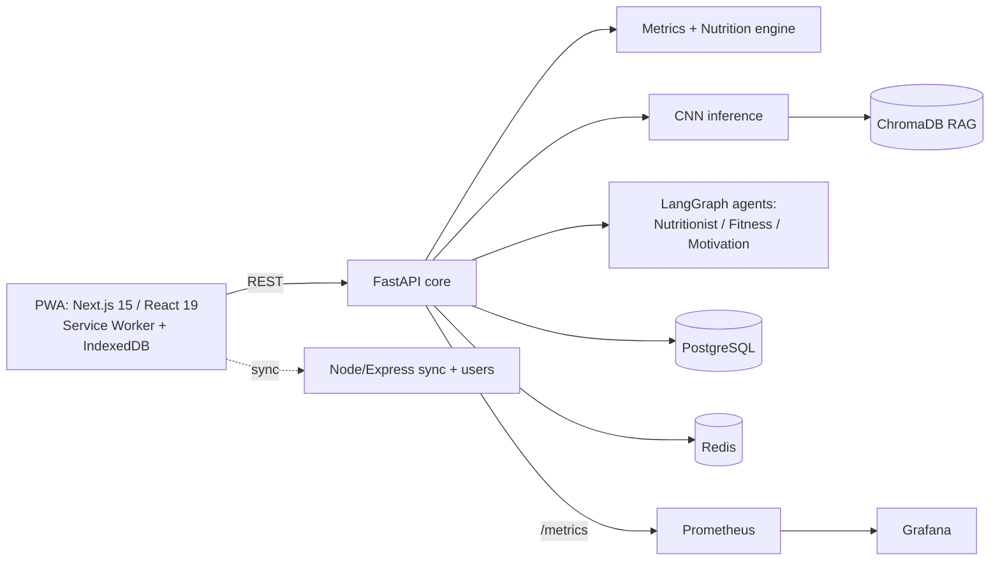

# AuraHealth AI

## Architecture


## Run locally
```bash
cp .env.example .env        # set passwords and JWT_SECRET
docker compose up --build
curl localhost:8000/health
# register, then use the returned token
TOKEN=$(curl -s -X POST localhost:4000/auth/register -H 'content-type: application/json' -d '{"email":"you@example.com","password":"a-long-password"}' | python3 -c 'import sys,json;print(json.load(sys.stdin)["token"])')
curl -X POST localhost:8000/v1/analyze -H "authorization: Bearer $TOKEN" -H 'content-type: application/json' \
 -d '{"sex":"male","age":24,"weight_kg":80,"height_cm":178,"neck_cm":38,"waist_cm":88,"goal":"aggressive_fat_loss","level":"beginner","allergies":["nuts"]}'
```
API docs: http://localhost:8000/docs · App: :3000 · Prometheus: :9090 · Grafana: :3001

## Status
Working: metrics, foods matrix, training plan, scan endpoint (stub CNN, live RAG hook), LangGraph loop, JWT/RBAC, Node auth + idempotent offline sync, IndexedDB queue, service worker, dashboard, Docker, Prometheus.
Next: train a Food-101 model and seed ChromaDB, Next.js scaffold (`npx create-next-app`, drop in `components/`, `lib/`, `public/`, set `output: "standalone"`), Postgres migrations, Grafana dashboards, HealthKit/Health Connect bridge.
